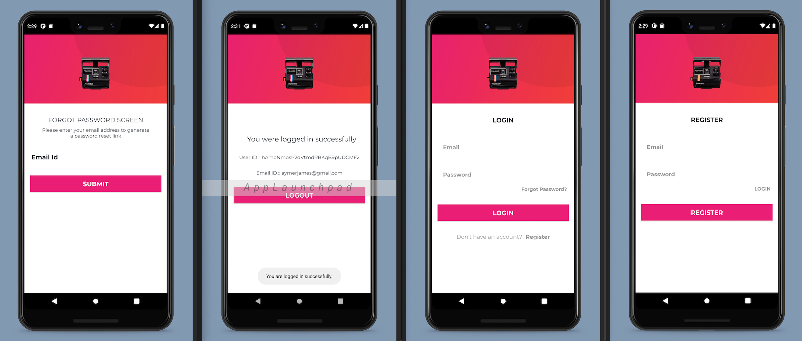

# Firebase Authorisation

## About The Project

This project was used to understand how to bake the functionality of Google Firebase into an application for user authentication.

Firebase Authentication can be used to allow users to authenticate, using both an email address and a password.

This basic application uses a series of activities to allow a user to enter their email address and password, which in turn provides authentication.

The Firebase API also provides the additional functionality of handling user logout, together with password reset. Both of these features were used.

## App Screenshots

## Built With

* [Kotlin: 1.5.10](https://kotlinlang.org/)
* [Android Studio: 4.2](https://developer.android.com/studio)
* [Android Lollipop: (5.0)](https://www.android.com/intl/en_uk/versions/lollipop-5-0/)
* [Android 5.0: (API level 21)](https://developer.android.com/about/versions/lollipop)

## Prerequisites

* [Kotlin: 1.5.10](https://kotlinlang.org/)
* [Android Studio: 4.2](https://developer.android.com/studio)
* [Android Lollipop: (5.0)](https://www.android.com/intl/en_uk/versions/lollipop-5-0/)
* [Android 5.0: (API level 21)](https://developer.android.com/about/versions/lollipop)

## License

Distributed under the MIT License. See `LICENSE` for more information.

## Contact

- [Email](mailto:aymerjames@gmail.com)
- [Linkedin](https://uk.linkedin.com/in/jamesaymer)
- [Github](https://github.com/JaymoAymer)

## Acknowledgements

* [Authenticate with Firebase using Password-Based Accounts on Android](https://firebase.google.com/docs/auth/android/password-auth?authuser=0)